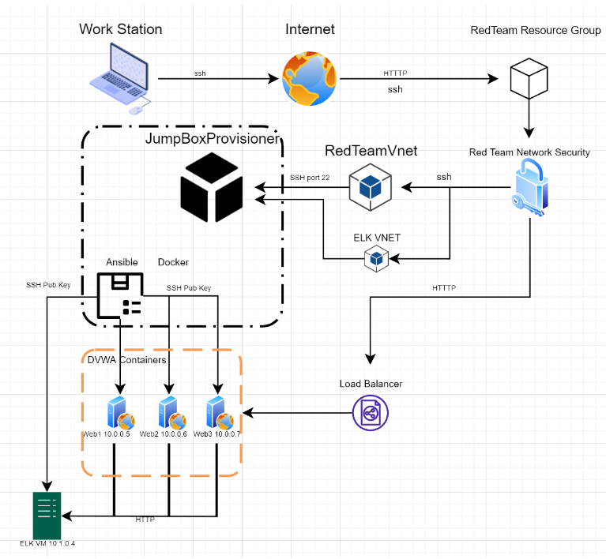

## Automated ELK Stack Deployment

The files in this repository were used to configure the network depicted below.

These files have been tested and used to generate a live ELK deployment on Azure. They can be used to either recreate the entire deployment pictured above. Alternatively, select portions of the YML file may be used to install only certain pieces of it, such as Filebeat.

[ELKplaybook](Ansible/ELKplaybook.yml)
								  								  
								  
This document contains the following details:
- Description of the Topology
- Access Policies
- ELK Configuration
  - Beats in Use
  - Machines Being Monitored
- How to Use the Ansible Build

### Description of the Topology

The main purpose of this network is to expose a load-balanced and monitored instance of DVWA, the D*mn Vulnerable Web Application.

Load balancing ensures that the application will be highly available, in addition to restricting traffic to the network.
- _TODO: What aspect of security do load balancers protect? What is the advantage of a jump box?_
	-Load balancers protects the availability. The adavantages of a jump box is that for automation and administrative network security. 

Integrating an ELK server allows users to easily monitor the vulnerable VMs for changes to the DVWA and system logs.
- _TODO: What does Filebeat watch for?_
	-Filebeat monitors changes in log files and events.
- _TODO: What does Metricbeat record?_
	-Metricbeat records the metrics and statistics.
	
The configuration details of each machine may be found below.
_Note: Use the [Markdown Table Generator](http://www.tablesgenerator.com/markdown_tables) to add/remove values from the table_.

| Name     | Function | IP Address | Operating System |
|----------|----------|------------|------------------|
| JumpBox  | Gateway  | 10.1.0.4   | Linux            |
| Web-1    | Webserver| 10.1.0.5   | Linux            |
| Web-2    | Webserver| 10.1.0.6   | Linux            |
| Web-3    | Webserver| 10.1.0.7   | Linux            |
|ELK-SERVER| Monitor  | 10.0.0.4   | Linux            |

### Access Policies

The machines on the internal network are not exposed to the public Internet. 

Only the JumpBoxProvisioner machine can accept connections from the Internet. Access to this machine is only allowed from the following IP addresses:
- Workstation Public IP (100.14.25.188) through TCP 5601.

Machines within the network can only be accessed by JumpBoxProvisioner.
- JumpBoxProvisioner IP: 10.1.0.4

A summary of the access policies in place can be found in the table below.

| Name     | Publicly Accessible | Allowed IP Addresses |
|----------|---------------------|----------------------|
| JumpBox  | Yes                 | 100.14.25.188        |
|  Web-1   | NO                  | 10.1.0.4             |
|  Web-2   | NO                  | 10.1.0.4             |
|  Web-3   | NO                  | 10.1.0.4             |
|ELK-SERVER| NO                  | 10.1.0.4             |

### Elk Configuration

Ansible was used to automate configuration of the ELK machine. No configuration was performed manually, which is advantageous because...
- _TODO: What is the main advantage of automating configuration with Ansible?_
	-The main advantages of automating configuration with Ansible is that it can efficiently deploy applications with flexiable settings to fit the critera across multiple VMs.
	
The playbook implements the following tasks:
- _TODO: In 3-5 bullets, explain the steps of the ELK installation play. E.g., install Docker; download image; etc._
- Install docker.io
- install pip3
- Install Pyhton Docker Module
- Download and Run elk container

The following screenshot displays the result of running `docker ps` after successfully configuring the ELK instance.

### Target Machines & Beats
This ELK server is configured to monitor the following machines:
- _TODO: List the IP addresses of the machines you are monitoring_
	- Web1 10.1.0.5 Web2 10.1.0.6 Web3 10.1.0.7

We have installed the following Beats on these machines:
- _TODO: Specify which Beats you successfully installed_
	-Filebeat and Metricbeat

These Beats allow us to collect the following information from each machine:
- _TODO: In 1-2 sentences, explain what kind of data each beat collects, and provide 1 example of what you expect to see. E.g., `Winlogbeat` collects Windows logs, which we use to track user logon events, etc._
	-Filebeat collects the log events while Metricbeat collects the metrics and system statistics.
	
### Using the Playbook
In order to use the playbook, you will need to have an Ansible control node already configured. Assuming you have such a control node provisioned: 

SSH into the control node and follow the steps below:
- Copy the Playbook Configuration file to YML playbook.
- Update the YML file to include installion of applications (Filebeat and Metricbeat).
- Run the playbook, and navigate to Kibana to check that the installation worked as expected.

_TODO: Answer the following questions to fill in the blanks:_
- _Which file is the playbook? Where do you copy it?_
	-The YML files are the playboooks and you copy it into the docker container.
- _Which file do you update to make Ansible run the playbook on a specific machine? How do I specify which machine to install the ELK server on versus which to install Filebeat on?_
	-You update the hosts file and specify and organize the private IP addresses their grouped webservers then within the playbook you upate the group webservers name to install the applications.
- _Which URL do you navigate to in order to check that the ELK server is running?
	-http://[your.VM.IP]:5601/app/kibana

_As a **Bonus**, provide the specific commands the user will need to run to download the playbook, update the files, etc._